李大拿的键盘固件V0.2说明
=====================
LDN_RGB_KeyBoard_FirmwareV0.2-help
=====================
李大拿的键盘固件V0.2的帮助文件，各种设置功能的说明和例子等等，我不懂英文，所以英文的是使用谷歌翻译的，国际友人凑合看吧。 
LDN keyboard firmware V0.2 help files, descriptions and examples of various settings functions, etc., I don't know English, so English is to use Google Translate, international friends can make it look.
****
Editor:LDN

[返回主目录](https://github.com/lswhome/LDN_RGB_KeyBoard_FirmwareV0.2-help "点击返回")

****
## 配置示例
   * [通过FN键和层来实现更多功能](#通过FN键和层来实现更多功能)
   * [FN的条件触发配置](#FN的条件触发配置)

  ----
### 通过FN键和层来实现更多功能
   * 配置一个FN键
   * 层0默认为标准键码
   * 层1配置为多媒体功能，以及调整灯光
   * **实现的效果就是按下FN键，可以使用层1配置的功能，层1未配置的仍然执行层0的功能，释放FN键，则恢复默认值，层1的功能无效**
   #### 步骤
   * 打开驱动软件，确定已连接到键盘（标题栏提示KeyBoard Connected）
   * 切换到功能层配置
   * 点击\[**下载配置**\]，此时默认会把层0的配置从键盘下载到驱动上，类似如下界面： 
   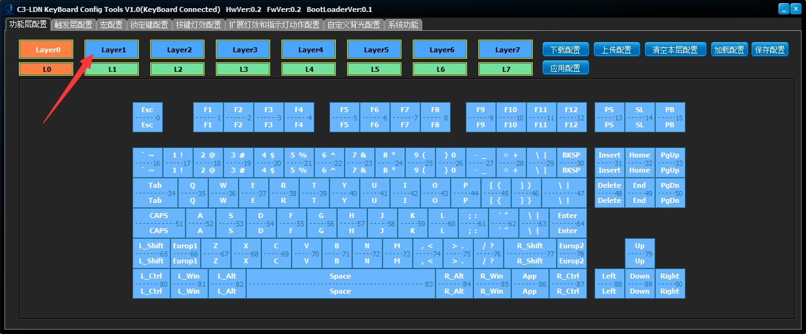
   * 此时点击箭头所指，切换到功能层1，点击\[**下载配置**\]，此时界面默认为所有的按键都未配置，如下所示： 
   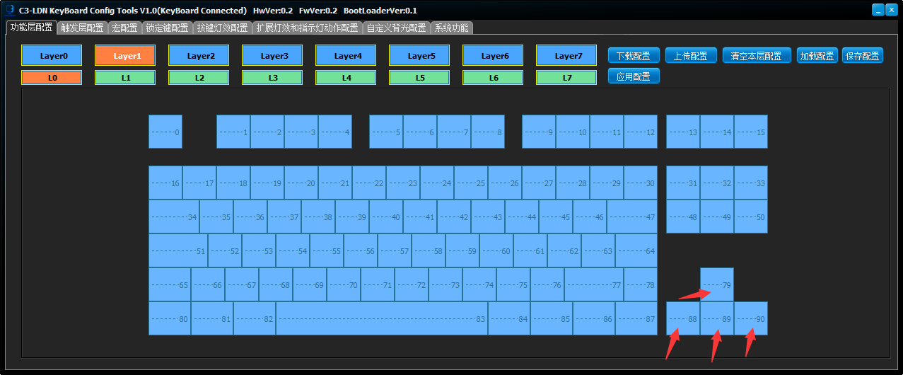
   * 分别点击四个方向键的下半部分，弹出功能选择框，切换到**多媒体按键**界面： 
   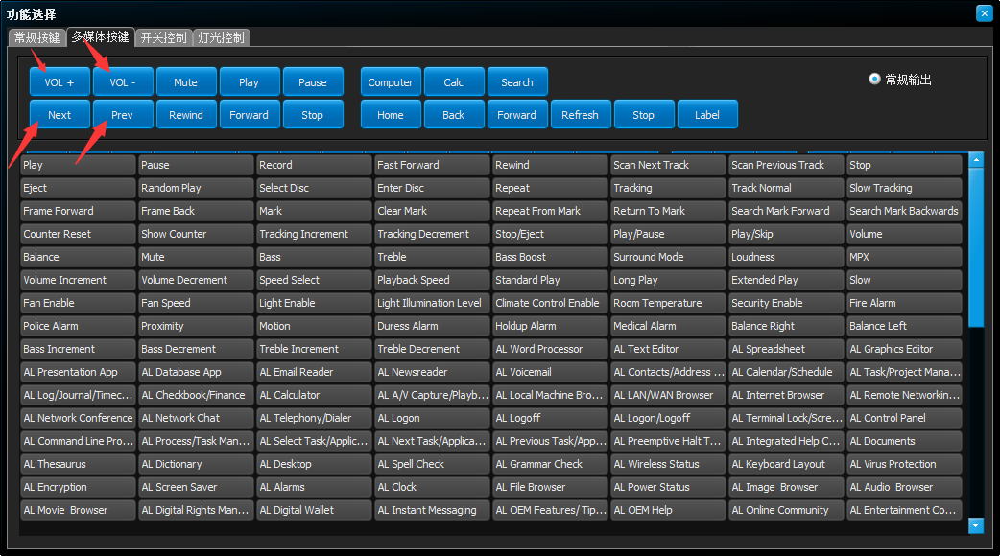
   * 分别为左箭头配置为\[Prev\]，右箭头配置为\[Next\]，上箭头配置为\[VOL +\]，下箭头配置为\[VOL -\]作为多媒体功能，如下所示： 
   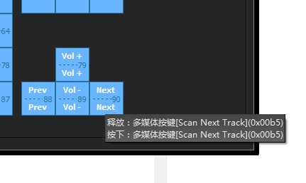
   * 点击按键编号为15,33,50的按键下半部分： 
   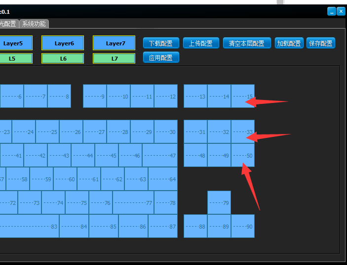
   * 弹出功能选择窗口，切换到**灯光控制**页面，分别为编号为15的按键配置为**打开或者关闭背光**，33的按键配置为**下一个背光灯效**，50的按键配置为**上一个背光灯效**，如下： 
   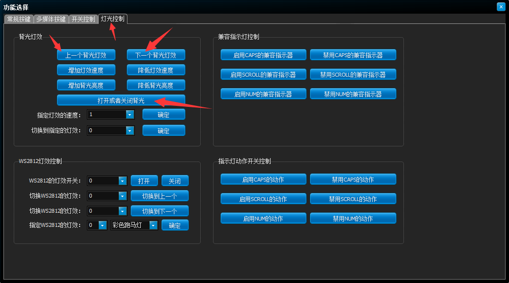
   * 配置完毕如下： 
   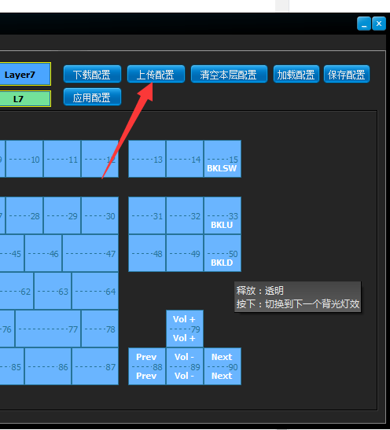
   * 点击\[**上传配置**\]，完成功能层1的配置
   * 切换到**触发层配置**的**FN键配置**，如下： 
   
   * 此时默认激活的触发层是0层，默认的参考层是0层，当前编辑的触发层为0层，点击**下载配置**，从键盘内下载配置，查看是否曾经有配置，如果没有，应该和上图相同
   * 点击**Index** 为 0 的行，后面的**OFF**，此时变成**ON**，表示启用这个编号为0的FN键
   * 点击**FnKeyID**为 0 的行，此时背景变为橘黄色，之后点击下面参考层上**按键编号为85**（R_Win）的按键，作为FN键，如下图： 
   
   * 点击**按下按键触发的事件**为0的行，弹出功能选择窗口，切换到**开关控制**页面，点击**设为最高优先级**：后面的下拉框，选择1，确定，这表示**将功能层1设置为最高优先级**，确定后功能选择窗口自动关闭
   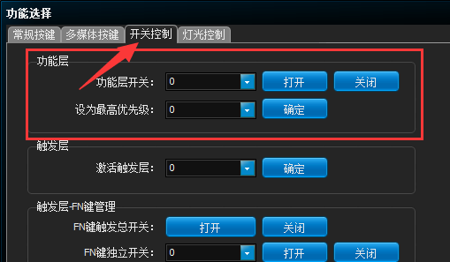
   * 点击**释放按键触发的事件1**为0的行，弹出功能选择窗口，切换到**开关控制**页面，点击**设为最高优先级**：后面的下拉框，选择0（默认是0），确定，这表示**将功能层0设置为最高优先级**，确定后功能选择窗口自动关闭，此时界面如下所示： 
   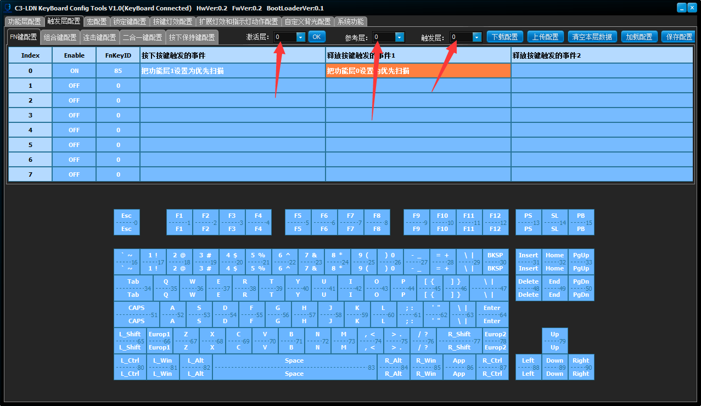
   * 确定如上图箭头所指处相同后，点击**上传配置**，则完成配置
   * 此时在驱动上，切换到**功能层配置**页面，按下R_Win按键，即可看到层1被激活(L1的底色变为橘黄色)，释放R_Win键，层0被激活(L0的底色变为橘黄色)，这表示层被正确的切换，如下所示： 
   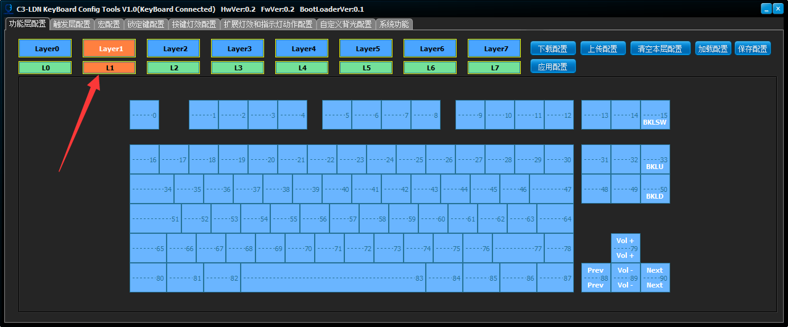
   * 则此次编程的功能为（R_Win配置为FN键0）：
     * FN+上箭头 = 音量+
     * FN+下箭头 = 音量-
     * FN+左箭头 = 上一首歌
     * FN+右箭头 = 下一首歌
     * FN+Pause Break = 打开/关闭背光
     * FN+Page UP = 切换到上一个背光
     * FN+Page Down = 切换到下一个背光
   * 编程思想为：
     * 将R_Win配置为FN键0
     * 当按下FN键0的时候，将功能层1设置为最高优先级，最高优先级的层，优先扫描，因此按下FN键0后，层1的已配置按键的功能优先执行，未配置的仍然会按照0-7的扫描顺序，执行层0配置的功能
     * 当释放FN键0的时候，将功能层0设置为最高优先级，此时层0优先级最高，由于层0默认所有的按键都已配置，因此会覆盖所有层的功能，这样就只能执行层0配置的功能了
     * **实现的效果就是按下FN键，可以使用层1配置的功能，层1未配置的仍然执行层0的功能，释放FN键，则恢复默认值，层1的功能无效**
----
### FN的条件触发配置
   * 要求实现的效果：
     * 按下FN键，切换到层1，此时按下FN+任意键=使用层1配置的功能，层1未配置的仍然执行层0的功能
     * 按下FN键，如未按下任何键，则输出空格键
   * 编程思想为：
     * 将SPACE键配置为FN0
     * 配置**按下FN0的事件**为切换到层1
     * 配置**释放FN0的事件1**为切换到层0，并输出一次SPACE的按下和释放事件
     * 配置**释放FN0的事件2**为切换到层0
     * 实现的具体效果：按下FN0并释放=输出空格，按下FN0+任意其他按键=输出层1配置的功能，如果层1未配置，则输出层0的功能
   #### 步骤
   * 打开驱动软件，确定已连接到键盘（标题栏提示KeyBoard Connected）
   * 切换到功能层配置，点击\[**下载配置**\]，切换到**Layer1**，点击\[**下载配置**\]，编辑层1的功能
   * 层1做如下配置：
     * 字母J = 音量-
     * 字母K = 音量+
     * 字母U = 切换到上一个灯效
     * 字母I = 切换到下一个灯效
     * 字母N = 静音
     * 字母M = 打开/关闭背光
     * 字母B = 打开计算器
     * 配置完毕如下图所示：
     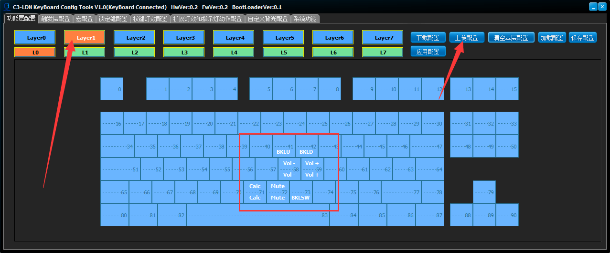
   * 点击\[**上传配置**\]，功能层1配置完毕
   * 由于FN键的触发，每个事件触发后只能做一件事，所以要做多件事需要使用宏，因此切换到**宏配置**页面，在组0配置如下脚本，并**上传**： 
   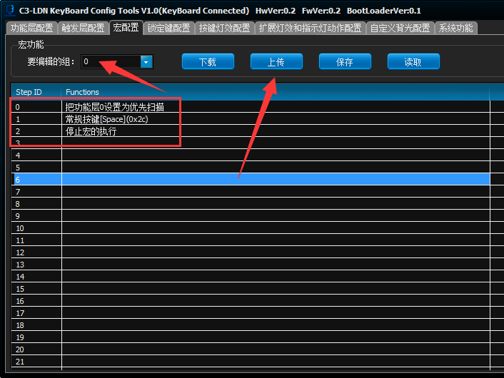
   * 切换到**触发层配置**->**FN键配置**页面，配置**Index**为0的行为如下配置：
     * Enable：ON
     * FnKeyID：选择Space(83)，注意：不同的键盘编号可能有所不同，选择Space就对了
     * 按下按键触发的事件：设置切换到层1
     * **释放按键触发的事件1**：运行宏组0，从步0开始
     * **释放按键触发的事件2**：切换到层0
     * 完毕后点击上传，如下图：
     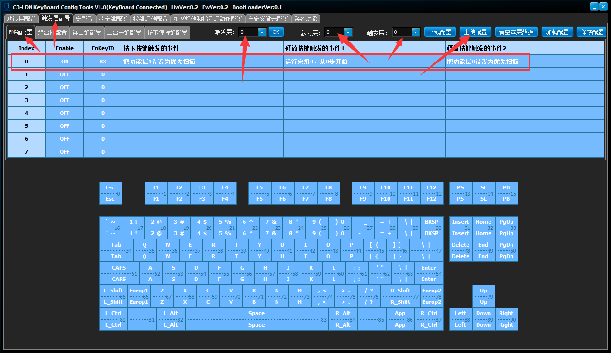
   * 如此即配置完毕
----
[返回主目录](https://github.com/lswhome/LDN_RGB_KeyBoard_FirmwareV0.2-help "点击返回")

