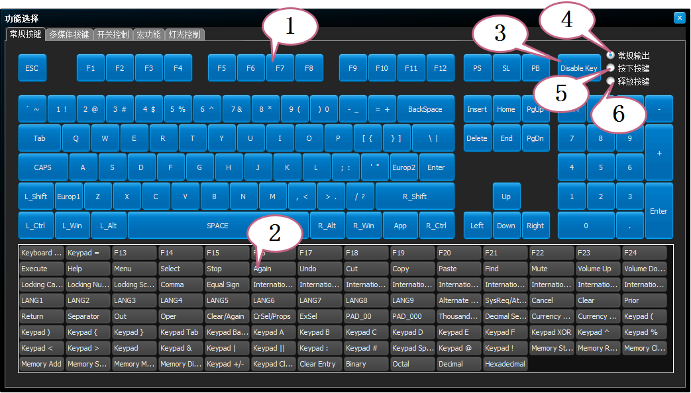
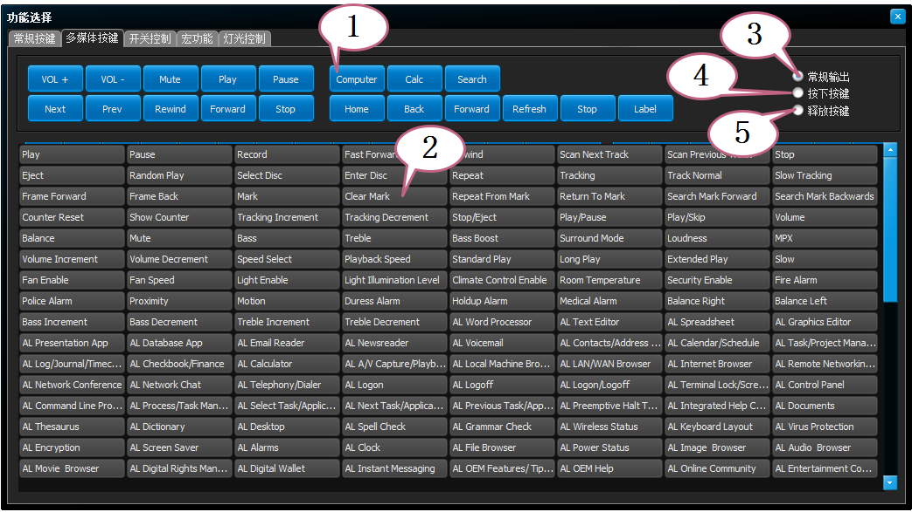
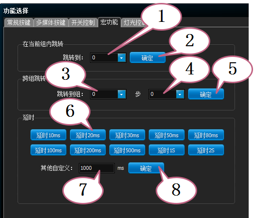

李大拿的键盘固件V0.2说明
=====================
LDN_RGB_KeyBoard_FirmwareV0.2-help
=====================
李大拿的键盘固件V0.2的帮助文件，各种设置功能的说明和例子等等，我不懂英文，所以英文的是使用谷歌翻译的，国际友人凑合看吧。 
LDN keyboard firmware V0.2 help files, descriptions and examples of various settings functions, etc., I don't know English, so English is to use Google Translate, international friends can make it look.
****
Editor:LDN 
[返回主目录](https://github.com/lswhome/LDN_RGB_KeyBoard_FirmwareV0.2-help "点击返回")
****
## 功能选择
   * 所有可被触发的功能，都在功能选择窗口内提供
   * 选择了一个有效的功能后，窗口会自动关闭，表示选择完毕
   * 在不同的配置页面弹出的功能选择窗口，内容会根据配置页面的不同而有所不同
   * 当功能选择窗口被弹出的时候，默认是常规按键页面
#### 常规按键页面

   * 1-> 一个标准的ISO键盘布局，这是常用的键码选择，单击即可选择一个按键功能
   * 2-> 不常用的键码，都在这里列出，单击即可选择一个按键功能（注意：这里的功能不是所有的操作系统都支持）
   * 3-> Disable Key，禁用一个按键，点击后，某个按键会被禁用，扫描器碰到这个功能，就会停止扫描，不做任何事情
   * 4-> 常规输出，常规的方式输出一个键码（通常包含按下和释放事件）
   * 5-> **宏使用，选择这个功能，只会发出按下按键的指令给电脑**
   * 6-> **宏使用，选择这个功能，只会发出按键释放的指令给电脑**
   * **当选择一个功能的后，窗口会自动关闭**
----
#### 多媒体按键页面

   * 1-> 常用多媒体功能在上部分提供
   * 2-> 不常用功能在下部分提供（注意：这里的功能不是所有的操作系统都支持）
   * 3-> 常规输出，常规的方式输出一个键码（通常包含按下和释放事件）
   * 4-> **宏使用，选择这个功能，只会发出按下按键的指令给电脑**
   * 5-> **宏使用，选择这个功能，只会发出按键释放的指令给电脑**
----
#### 开关控制页面

   * 1-> 功能层开关：这里选择操作哪个功能层
   * 2-> 打开：打开刚才选择的功能层
   * 3-> 关闭：关闭刚才选择的功能层
   * 4-> 把某个功能层设置为优先扫描，被设置的功能层具有最先扫描的优先级
   * 5-> 点击确定，即可设置某层为最高优先级
   * 6-> 选择要激活的**触发层**，点击(7)即可完成命令的设定
   * 7-> 点击后即可设定一个激活某触发层的功能
   * 8-> FN键触发总开关：**打开**，选择打开（默认值就是打开），允许所有的FN键启动触发
   * 9-> FN键触发总开关：**关闭**，选择关闭，这将禁止所有的FN键触发
   * 10->FN键独立开关：这里选择要操作的FN键的编号，从0-7
   * 11->**打开**，允许某个编号的FN键触发，这样这个FN键就可以使用了（如果禁止了所有的FN键触发，则即使是打开的，也无法触发）
   * 12->**关闭**，禁止某个变厚的FN键触发，这样这个FN键就无法触发了
   * **组合键管理 连击键管理 二合一键管理 保持触发键管理**的开关功能与(8-12)的描述意义相同，请参考
   * 13->这里选择一个**内部的按键编号**
   * 14->打开，表示启用这个按键编号的触发（默认所有的按键都是启用的）
   * 15->关闭，表示禁止这个按键编号的触发，这样这个按键在最底层的按键扫描驱动层就会被禁止扫描，因此禁用后，**无论这个按键配置了任何功能，都不会被触发**
   * 16->运行一组宏：选择要运行哪个编号的宏脚本，从0-99可选
   * 17->选择从这组宏的哪一步开始执行，默认从0开始
   * 18->确定后，即可设定一个运行一组宏的命令
   * 19->如果要立即停止一个正在运行的宏，则可以设置此命令，比如一个循环运行的宏，他并不会自动停止，这个命令可以让宏立即停止运行（或者再次启动一次宏的运行，就会自动停止当前正在运行的宏）
   * 20->锁定一组锁定键，从这里选择，从0-63，共计64组可选
   * 21->确定后即可设定一个锁定某组按键的功能，再次锁定这组按键，则会解除锁定
----
#### 宏功能页面

   
   
   
****
[返回主目录](https://github.com/lswhome/LDN_RGB_KeyBoard_FirmwareV0.2-help "点击返回")

